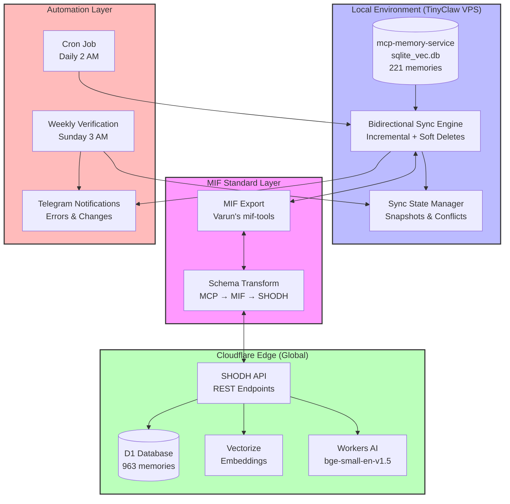
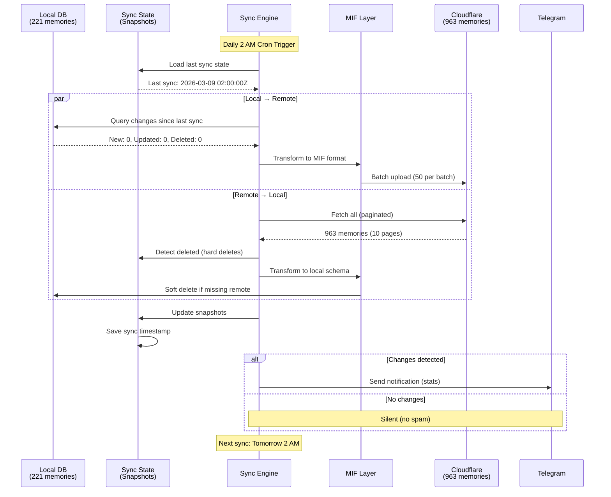

# MIF Integration Status Report

**Date:** March 9, 2026
**Project:** TinyClaw Memory Sync via MIF (Memory Interchange Format)
**Status:** ✅ Production Ready

---

## Executive Summary

Successfully implemented **bidirectional memory synchronization** between local mcp-memory-service and SHODH Cloudflare using **MIF (Memory Interchange Format)** as the interchange standard.

**Key Achievement:** 221 local memories syncing with 963 remote memories on Cloudflare Edge, fully automated with nightly sync and error monitoring.

---

## Architecture Overview



---

## Sync Flow (Bidirectional)



---

## Implementation Phases (Completed)

### ✅ Phase 1: Initial Export
- **Export Script:** `export_to_cloudflare.py`
- **Result:** 221 memories exported to Cloudflare
- **Format:** MIF JSON (Varun's spec v1.0)
- **Duration:** ~6 seconds

### ✅ Phase 2: Sync State Infrastructure
- **State Manager:** `sync_state.py`
- **Features:**
  - Local/remote snapshots
  - Conflict tracking
  - Statistics (sync count, duration, errors)
  - Automatic backup

### ✅ Phase 3: Bidirectional Sync
- **Sync Engine:** `sync_bidirectional.py`
- **Capabilities:**
  - Incremental sync (only changes)
  - Soft deletion handling (local `deleted_at`)
  - Hard deletion detection (remote absence)
  - Pagination (100 per page)
  - Dry-run mode
  - Change detection (new/updated/deleted)

### ✅ Phase 4: Automation
- **Cron Job:** `/etc/cron.d/tinyclaw-memory-sync`
- **Schedule:**
  - Daily sync: 2:00 AM
  - Weekly verification: Sunday 3:00 AM
- **Notifications:**
  - Telegram alerts on errors
  - Success summaries (if changes)
  - Verification reports

---

## MIF Standard Usage

**MIF Version:** 1.0
**Spec:** https://github.com/varun29ankuS/mif-spec
**Package:** `mif-tools` (PyPI)

### Schema Mapping

| Source | MIF Field | Destination |
|--------|-----------|-------------|
| `content` | `content` | `content` |
| `content_hash` | `id` | `content_hash` |
| `created_at_iso` | `created_at` | `created_at` |
| `memory_type` | `type` | `memory_type` |
| `tags` (CSV) | `tags` (array) | `tags` (JSON) |
| `deleted_at` | — | (soft delete) |

### Why MIF?

✅ **Vendor-neutral** — Works with mem0, LangChain, CrewAI, etc.
✅ **Portable** — Standard JSON format
✅ **Extensible** — Optional fields (embeddings, knowledge graph, entities)
✅ **Minimal** — Only 3 required fields (id, content, created_at)

---

## Current Statistics

| Metric | Value |
|--------|-------|
| **Local Memories** | 221 |
| **Remote Memories** | 963 |
| **Sync Duration** | ~6 seconds |
| **Pages Fetched** | 10 (100 per page) |
| **Last Sync** | 2026-03-09 16:49:44 |
| **Sync Count** | 3 |
| **Conflicts** | 0 |

---

## Automation Details

### Daily Sync (2 AM)

**Trigger:** Cron (`0 2 * * *`)
**Script:** `sync_cron.sh`
**Actions:**
1. Activate Python venv
2. Run `sync_bidirectional.py`
3. Detect changes (incremental)
4. Sync both directions
5. Log results
6. Send Telegram notification (if changes/errors)

**Example Success Notification:**
```
MEMORY SYNC COMPLETED

Duration: 6s

  Local memories: 221
  Remote memories: 963
  New: 0
  Updated: 0
  Deleted: 0

Last sync: 2026-03-09 16:49:44
```

### Weekly Verification (Sunday 3 AM)

**Trigger:** Cron (`0 3 * * 0`)
**Script:** `verify_sync_state.sh`
**Checks:**
- Local DB count vs State snapshot
- Remote API count vs State snapshot
- Reports discrepancies

**Example Report:**
```
WEEKLY SYNC VERIFICATION: PASSED

Local:  DB=221, State=221
Remote: API=963, State=963

All checks passed.
```

---

## Technical Highlights

### Soft Deletion Handling

**Challenge:** Local has soft deletes (`deleted_at`), remote has hard deletes (DELETE FROM)

**Solution:** Sync state tracks snapshots. Deletions detected by comparing current state with last snapshot:
- **Local deletion:** Set `deleted_at` → Propagate hard delete to remote
- **Remote deletion:** Not in current fetch → Soft delete locally

### Pagination

**Challenge:** SHODH API returns max 100 memories per page (default 20)

**Solution:** Implemented pagination loop with offset increment:
```python
limit = 100
offset = 0
while True:
    response = GET /api/memories?limit={limit}&offset={offset}
    if len(memories) < limit:
        break  # Last page
    offset += limit
```

### Error Handling

- **Network errors:** Logged, Telegram alert sent
- **State corruption:** Automatic backup, reinit available
- **Sync failures:** Retry on next cron run
- **Verification failures:** Alert with suggested fix

---

## Benefits Achieved

✅ **Multi-device Sync** — Memories available on laptop, phone, tablet
✅ **Global Edge** — Cloudflare <50ms latency worldwide
✅ **Automated** — Nightly sync, zero manual intervention
✅ **Monitored** — Telegram alerts on errors/changes
✅ **Verified** — Weekly consistency checks
✅ **Portable** — MIF format enables platform migration
✅ **Backup** — MIF exports saved locally

---

## Files & Code

### Core Scripts

| File | Purpose | LOC |
|------|---------|-----|
| `export_to_cloudflare.py` | Initial full export | 200 |
| `sync_bidirectional.py` | Bidirectional sync engine | 450 |
| `sync_state.py` | State management library | 300 |
| `init_sync_state.py` | State initialization | 100 |
| `sync_cron.sh` | Cron wrapper + notifications | 100 |
| `verify_sync_state.sh` | Weekly verification | 120 |

### Documentation

- `README.md` — Full integration guide
- `SYNC_ARCHITECTURE.md` — Design & conflict resolution
- `AUTOMATION.md` — Cron setup & troubleshooting

### Logs & State

- `/home/ubuntu/.tinyclaw/sync/sync.log` — Daily sync logs
- `/home/ubuntu/.tinyclaw/sync/verification.log` — Weekly checks
- `/home/ubuntu/.tinyclaw/sync/shodh-sync-state.json` — Current state
- `/home/ubuntu/.tinyclaw/sync/conflicts/*.json` — Conflict records

---

## Future Enhancements

### Planned (Later)

- **Web Dashboard** — Flask/FastAPI UI for sync status
- **Conflict Resolution UI** — Manual conflict resolution
- **Retry Logic** — Exponential backoff for transient failures

### Proposed

- **Multi-remote Support** — Sync to multiple Cloudflare accounts
- **Selective Sync** — By tags, date range, memory type
- **Delta Sync** — Only changed fields, not full memory
- **Compression** — Reduce API payload size

---

## Acknowledgments

**MIF Spec:** Created by Varun Sharma ([@varun29ankuS](https://github.com/varun29ankuS))
**SHODH Cloudflare:** Built by Heinrich Krupp ([@doobidoo](https://github.com/doobidoo))
**mcp-memory-service:** Open-source memory layer for AI agents

---

## Contact

**Project Owner:** Heinrich Krupp
**MIF Creator:** Varun Sharma
**Repository:** https://github.com/doobidoo/shodh-cloudflare
**MIF Spec:** https://github.com/varun29ankuS/mif-spec

---

**Status:** ✅ Production Ready
**Next Sync:** 2026-03-10 02:00:00 (Automatic)
